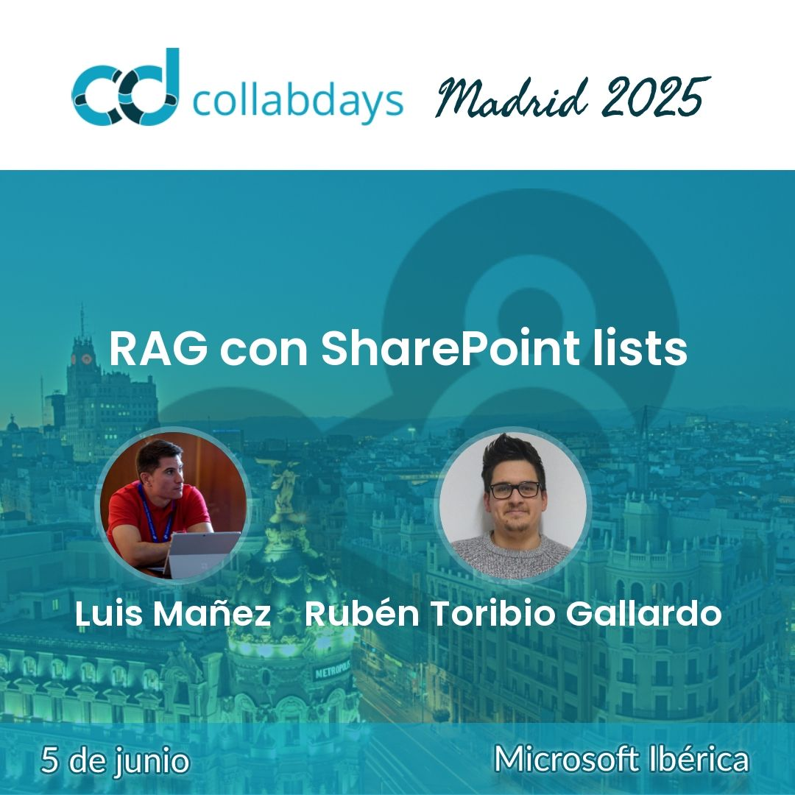

# CollabDays Madrid 2025 (5 Junio 2025)
Materiales de la sesión "RAG con SharePoint lists" impartida para el CollabDays Madrid 2025.

Más info: [CollabDays Madrid 2025](https://www.collabdays.org/2025-madrid/)

## Descripción
Sabes que M365 Copilot no es capaz de indexar contenido en Listas de SharePoint? lo arreglamos? ... en esta sesión veremos qué es el patrón RAG, cómo podemos implementarlo fácilmente con KernelMemory, y cómo indexar la información almancenada en listas de SharePoint, y traerla a Copilot a través de un Plugin personalizado.